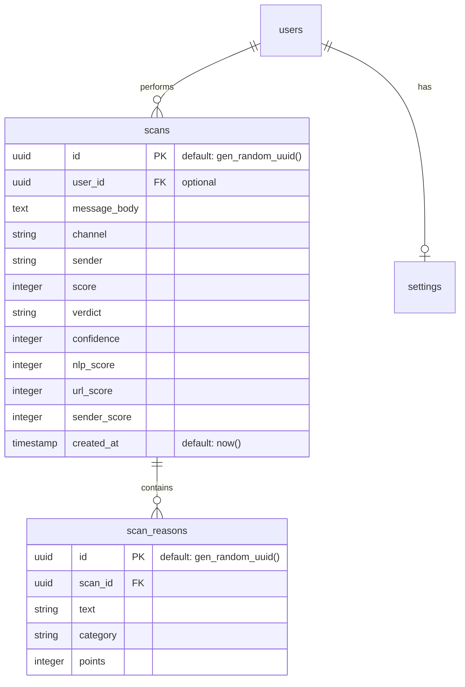

# Database Schema: Scam Fraud Detector (Supabase)

This document outlines the database design for the **Scam Fraud Detector** application, implemented in **Supabase** (PostgreSQL).

## 1. Relational ER Diagram



---

## 2. Table Definitions (SQL)

You can run the following SQL in the **Supabase SQL Editor** to set up the environment:

```sql
-- Scans Table
CREATE TABLE scans (
    id UUID PRIMARY KEY DEFAULT gen_random_uuid(),
    user_id UUID REFERENCES auth.users(id), -- Nullable for anonymous scans
    message_body TEXT NOT NULL,
    channel TEXT NOT NULL,
    sender TEXT,
    score INTEGER CHECK (score >= 0 AND score <= 100),
    verdict TEXT CHECK (verdict IN ('SAFE', 'SUSPICIOUS', 'FRAUD')),
    confidence INTEGER CHECK (confidence >= 0 AND confidence <= 100),
    nlp_score INTEGER DEFAULT 0,
    url_score INTEGER DEFAULT 0,
    sender_score INTEGER DEFAULT 0,
    created_at TIMESTAMPTZ DEFAULT now()
);

-- Scan Reasons Table
CREATE TABLE scan_reasons (
    id UUID PRIMARY KEY DEFAULT gen_random_uuid(),
    scan_id UUID REFERENCES scans(id) ON DELETE CASCADE,
    text TEXT NOT NULL,
    category TEXT NOT NULL,
    points INTEGER NOT NULL
);

-- Settings Table (Initial Design)
CREATE TABLE settings (
    id UUID PRIMARY KEY DEFAULT gen_random_uuid(),
    user_id UUID REFERENCES auth.users(id) UNIQUE,
    dark_mode BOOLEAN DEFAULT TRUE,
    safe_threshold INTEGER DEFAULT 40,
    fraud_threshold INTEGER DEFAULT 75,
    api_key_enc TEXT -- Encrypted if stored
);
```

---

## 3. Integration with FastAPI

- **Supabase Client**: Uses `SUPABASE_URL` and `SUPABASE_ANON_KEY` from `.env`.
- **Insertions**: The `analyze_message` endpoint performs a two-step insertion:
    1.  Inserts basic scan results into `scans`.
    2.  Inserts granular reasons into `scan_reasons` using the generated `scan_id`.

---

## 2. Relational Schema (PostgreSQL/MySQL)

### `users`
| Column | Type | Constraints | Description |
| :--- | :--- | :--- | :--- |
| `id` | `UUID` | `PRIMARY KEY` | Unique user identifier. |
| `email` | `VARCHAR(255)` | `UNIQUE`, `NOT NULL` | User email for login. |
| `password_hash` | `TEXT` | `NOT NULL` | Argon2 or bcrypt hash. |
| `created_at` | `TIMESTAMP` | `DEFAULT NOW()` | Account creation time. |

### `scans`
| Column | Type | Constraints | Description |
| :--- | :--- | :--- | :--- |
| `id` | `UUID` | `PRIMARY KEY` | Unique scan identifier. |
| `user_id` | `UUID` | `FOREIGN KEY` | Refers to `users.id`. |
| `message_body`| `TEXT` | `NOT NULL` | The analyzed content. |
| `channel` | `VARCHAR(50)` | `NOT NULL` | SMS, Email, WhatsApp, etc. |
| `sender` | `VARCHAR(100)` | `NULL` | Sender handle or number. |
| `score` | `INT` | `CHECK (0-100)` | Total risk score. |
| `verdict` | `VARCHAR` | `ENUM` | SAFE, SUSPICIOUS, FRAUD. |
| `confidence` | `INT` | `CHECK (0-100)` | AI confidence level. |
| `nlp_score` | `INT` | `DEFAULT 0` | Part of score (up to 40). |
| `url_score` | `INT` | `DEFAULT 0` | Part of score (up to 30). |
| `sender_score`| `INT` | `DEFAULT 0` | Part of score (up to 30). |
| `created_at` | `TIMESTAMP` | `DEFAULT NOW()` | When the scan occurred. |

### `scan_reasons`
| Column | Type | Constraints | Description |
| :--- | :--- | :--- | :--- |
| `id` | `UUID` | `PRIMARY KEY` | |
| `scan_id` | `UUID` | `FOREIGN KEY` | Refers to `scans.id`. |
| `text` | `VARCHAR` | `NOT NULL` | Reason (e.g., "Urgency detected"). |
| `category` | `VARCHAR` | `NOT NULL` | Categorization of the reason. |
| `points` | `INT` | `NOT NULL` | Impact on the final score. |

### `settings`
| Column | Type | Constraints | Description |
| :--- | :--- | :--- | :--- |
| `id` | `UUID` | `PRIMARY KEY` | |
| `user_id` | `UUID` | `UNIQUE`, `FK` | One settings profile per user. |
| `dark_mode` | `BOOLEAN` | `DEFAULT TRUE` | UI Preference. |
| `safe_threshold`| `INT` | `DEFAULT 40` | Custom warning level. |
| `fraud_threshold`| `INT` | `DEFAULT 75` | Custom alert level. |
| `api_key_enc` | `TEXT` | `NULL` | Encrypted Gemini API key. |

---

## 3. Document Schema (MongoDB/NoSQL)

A document-based approach is often easier for AI projects because it avoids joins for complex nested results like reasons and breakdowns.

### `Scan` Collection
```json
{
  "_id": "64b..." ,
  "user_id": "64a..." ,
  "content": {
    "body": "URGENT: Click http://scam.xyz",
    "channel": "sms",
    "sender": "+60123456789",
    "timestamp": "2026-04-05T02:14:00Z"
  },
  "analysis": {
    "score": 97,
    "verdict": "FRAUD",
    "confidence": 99,
    "breakdown": {
      "nlp": 38,
      "url": 30,
      "sender": 29
    },
    "reasons": [
      { "text": "Artificial Scarcity detected", "category": "NLP · Intent", "points": 15 },
      { "text": "High-risk TLD (.xyz) in URL", "category": "URL · Domain", "points": 20 }
    ]
  }
}
```

### `User` Collection
```json
{
  "_id": "64a..." ,
  "email": "user@example.com",
  "preferences": {
    "darkMode": true,
    "thresholds": { "safe": 40, "fraud": 75 },
    "apiKey": "encrypted_string_here"
  }
}
```

## 4. Key Considerations

1.  **Security**: The `api_key` MUST never be stored in plain text. If a user provides their own key in settings, it should be encrypted with a server-side secret before being persisted.
2.  **Indexing**: Frequent queries will be on `user_id + created_at` for the dashboard history.
3.  **Data Retention**: Consider an automated cleanup or archival process for message bodies older than 90 days to maintain privacy and reduce storage costs.
